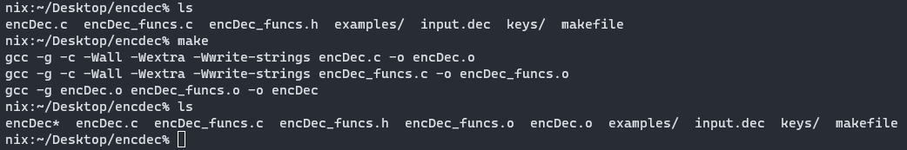
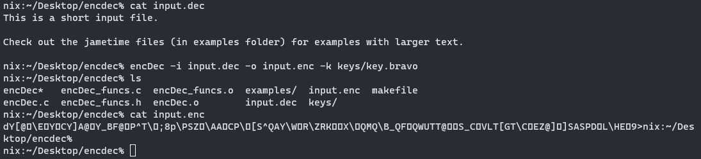

# EncryptionDecryption
A program to encrypt and decrypt a plain text file in C

To compile the code, use the makefile by typing "make" in the directory.


You can encrypt the data in a file (with any filetype ending) by typing: <br />
```encDec -i [input file] -o [output file] -k [encryption key]```. <br />
The order of the input file (-i), output file (-o) and key file (-k) can be specified in any order. The output file does not need to exist, it will be made when the program is successfully run. <br />

For example, I pass through the file ```input.dec``` with the name of the output file I want (which the program creates) and a key file (key.bravo).

As you can see the output file, ```input.enc```, is different from ```input.dec```.

To change the encrypted file back to a decrypted file, pass the outputted encrypted file as an input with the same encryption key and overwrite or make a new file for the new output file.

I pass the outputted file ```input.enc``` as an input file, have the program create a new output file ```input.txt``` and pass in the same key file (key.bravo).

The file endings do not have to be ```.enc```, ```.dec```, or ```.txt```. They can be any file endings.
